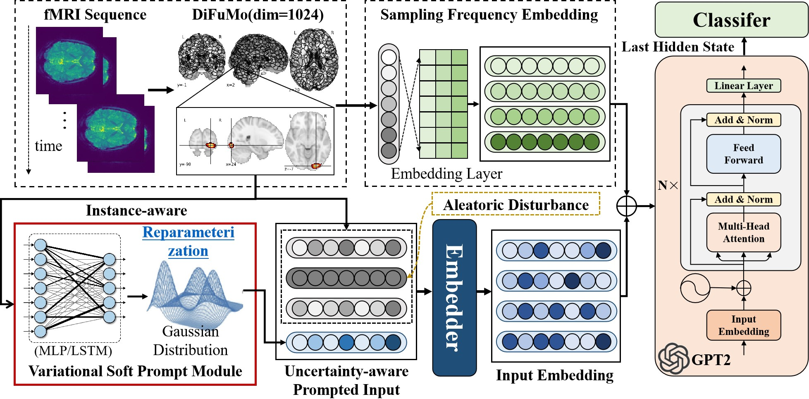

# Uncertainty-aware Varitional Soft Prompt for Few-shot Learning in fMRI-based Mental State Decoding

## About

This repo contains the source code about our recent paper,and it is developed based on the codes: 
https://github.com/athms/learning-from-brains

## Data

Please download the data from [figshare](https://figshare.com/projects/Self-Supervised_Learning_of_Brain_Dynamics_from_Broad_Neuroimaging_Data/172176) 

For the detailed information, please refer to the repo above.

## Pre-trained models

Please download the pre-trained models from [figshare](https://figshare.com/projects/Self-Supervised_Learning_of_Brain_Dynamics_from_Broad_Neuroimaging_Data/172176) and place them in `results/models`.

## Basic usage

Once the data and pretrained model are downloaded and placed in the appropriate directory, you can directly execute the "train_run_hcp.sh" or "train_run_mdtb.sh".
